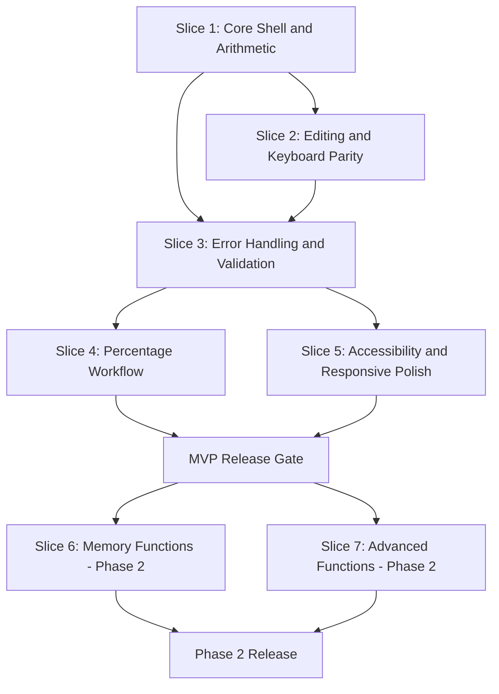

# Web Calculator Implementation Plan

## Goal And Context

Deliver a production-ready web calculator in thin vertical slices, prioritizing core arithmetic reliability first, then usability and accessibility, followed by optional phase 2 capabilities.

### Scope Baseline

- In scope for initial release: FR-001 through FR-006, NFR-001 through NFR-005
- Deferred to phase 2: FR-007 and FR-008
- Hosting target: static deployment on GitHub Pages
- Architecture: single client-side application (no server runtime)

## Requirements And User Stories

### Requirement Mapping

- Slice 1: FR-001, FR-002
- Slice 2: FR-003, FR-005
- Slice 3: FR-004, NFR-004, NFR-005
- Slice 4: FR-006
- Slice 5: NFR-001, NFR-002, NFR-003
- Slice 6 (Phase 2): FR-007
- Slice 7 (Phase 2): FR-008

### Delivery User Stories

- As a user, I can complete common arithmetic tasks quickly with keyboard or mouse input.
- As a user, I can recover from mistakes and errors without refreshing the page.
- As a user, I can use percentage workflows consistently for consumer math.
- As a user, I can use the calculator on mobile and with assistive technologies.

## Acceptance Criteria

### Slice-Level Exit Criteria

1. Slice 1 exit

- Expression entry and evaluation support +, -, \*, / with decimal inputs.
- Unit tests pass for core arithmetic examples from spec.

2. Slice 2 exit

- AC, Backspace, and Esc behaviors are implemented and consistent.
- Keyboard and click paths use shared action handling and produce identical outcomes.

3. Slice 3 exit

- Invalid expressions and divide-by-zero produce explicit error state.
- Error recovery works without reload and no uncaught runtime errors occur in normal flows.
- Expression evaluation implementation avoids unsafe execution patterns.

4. Slice 4 exit

- Percent behavior is implemented per documented model.
- Spec scenarios including 200\*10% and 50+10% pass automated tests.

5. Slice 5 exit

- Keyboard reachability and accessible naming are validated.
- Layout is usable at 320px and desktop widths.
- Color contrast and focus visibility meet WCAG AA goals.

6. Phase 2 exit criteria

- Slice 6: memory operations (MC, MR, M+, M-, MS) tested end-to-end.
- Slice 7: trig functions, angle mode, and circle area helper tested and documented.

### Release Gate (Initial Release)

- All P0 and P1 requirements (FR-001 to FR-006) complete.
- No open P0 defects in arithmetic, editing, keyboard, error handling, or percentage workflows.
- Test suite green: unit + end-to-end smoke path.
- Performance and accessibility checkpoints met.

## Priority And Rationale

### Priority Order

1. P0 - Core arithmetic and interaction reliability

- Slices 1 through 3
- Rationale: establishes base value and trust in computation correctness.

2. P1 - Percentage workflows

- Slice 4
- Rationale: high-frequency real-world need for discounts/tax/tips.

3. P1 - Accessibility and responsive polish

- Slice 5
- Rationale: broad usability and compliance-aligned quality for launch.

4. P2 - Extended capability

- Slices 6 and 7
- Rationale: useful enhancements, not blockers for MVP launch.

## Delivery Plan

### Phase 1: MVP Foundations (Week 1)

- Implement Slice 1 and Slice 2.
- Create calculator state model and action dispatcher shared by keyboard/click input.
- Add baseline unit tests for arithmetic, edit, and clear paths.

### Phase 2: Reliability Hardening (Week 2)

- Implement Slice 3.
- Add input validation and explicit error states.
- Add reliability tests for malformed expressions and divide-by-zero.

### Phase 3: Consumer Math And Launch Quality (Week 3)

- Implement Slice 4 and Slice 5.
- Finalize percentage model documentation and tests.
- Run accessibility pass and responsive QA.
- Prepare GitHub Pages build/deploy checklist.

### Phase 4: Optional Enhancements (Week 4+)

- Implement Slice 6 (memory) and Slice 7 (advanced functions) if capacity permits.
- Keep phase 2 behind release tagging to avoid delaying MVP.

## Dependencies Diagram

- Slices 1 through 5 form the initial release dependency chain.
- Slices 6 and 7 depend on MVP stability and can proceed in parallel.

## Implementation Backlog (Actionable)

### Epic A: Calculator Core

1. Build calculator domain state and action model.
2. Implement tokenized input handling for numbers/operators/decimal.
3. Implement safe expression evaluator with deterministic operator behavior.
4. Add display renderer for expression and result states.

### Epic B: Interaction And Error Recovery

1. Add AC and Backspace actions.
2. Add keyboard bindings and parity tests.
3. Add validation pipeline and error-state transitions.
4. Add recovery rules after error and post-evaluation chaining behavior.

### Epic C: Percentage And UX Quality

1. Implement and document percentage rules.
2. Add regression tests for percent scenarios.
3. Apply accessibility labels, focus management, and live result announcements.
4. Complete responsive layout adjustments for 320px through desktop.

### Epic D: Phase 2 Extensions

1. Add memory register and operations.
2. Add trig and DEG/RAD mode model.
3. Add circle area helper function.
4. Expand tests and update user help text.

## Metrics And Next Steps

### Success Metrics

- Core task completion: at least 95% of users complete five core calculations.
- Error recovery: at least 90% of error states resolved in one corrective action.
- Performance: p95 evaluation latency below 50ms.
- Reliability: zero P0 production defects in core arithmetic for initial release period.

### Tracking Metrics By Phase

- Phase 1: arithmetic/edit test pass rate and keyboard parity pass rate.
- Phase 2: error-path pass rate and uncaught exception count.
- Phase 3: accessibility audit pass rate and mobile layout defects.
- Phase 4: optional feature adoption and defect density.

### Immediate Next Steps

1. Confirm percentage model wording for ambiguous expressions beyond the two required examples.
2. Create implementation tasks in work tracking aligned to slices and exit criteria.
3. Start Slice 1 execution with tests-first approach for arithmetic examples.
